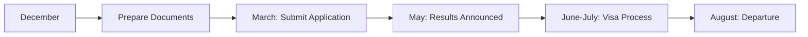

# CENGMAN Content Templates

This file contains template examples for each content section with all possible Markdown syntax.

---

## 📁 Department Template

```markdown
---
title: "Sample Department Guide"
author: "Your Name"
date: "2024-01-15"
tags: ["department", "procedures", "lab"]
summary: "Complete guide for department procedures and lab access"
---

# Department Guide Title

Brief introduction paragraph explaining what this guide covers.

## Prerequisites

Before following this guide, make sure you have:

- [ ] Student ID card
- [ ] University email access
- [ ] VPN connection (if remote)

## Step-by-Step Instructions

### 1. Initial Setup

First, you need to complete the registration process:

1. **Visit the department office**
   - Location: CENG Building, Room 123
   - Hours: 09:00-17:00, Monday-Friday
   - Required documents: Student ID, transcript

2. **Fill out the form**
   - Download: [Registration Form](/files/department/registration-form.pdf)
   - Submit online: [Department Portal](https://dept.metu.edu.tr)

### 2. Lab Access Configuration

#### Remote Connection

Connect to lab computers using SSH:

```bash
# Connect to lab server
ssh username@lab.ceng.metu.edu.tr

# Set up port forwarding
ssh -L 8080:localhost:8080 username@lab.ceng.metu.edu.tr
```

#### Software Installation

Install required packages:

```python
# Python packages
pip install numpy pandas matplotlib

# Example usage
import numpy as np
data = np.array([1, 2, 3, 4, 5])
print(f"Mean: {data.mean()}")
```

## Important Notes

> **Warning:** Always backup your work before making system changes.

> **Tip:** Use version control for all your projects.

## Troubleshooting

| Problem | Solution |
|---------|----------|
| Cannot connect to VPN | Check network settings |
| Permission denied | Contact system admin |
| Software not working | Reinstall packages |

## Contact Information

- **System Admin:** admin@ceng.metu.edu.tr
- **Office Hours:** Mon-Fri 09:00-17:00
- **Emergency:** +90 312 210 xxxx

## Screenshots


*Figure 1: Main lab interface showing available resources*


*Figure 2: VPN configuration steps*

## Related Resources

- [University IT Services](https://it.metu.edu.tr)
- [Department Homepage](https://ceng.metu.edu.tr)
- [Student Portal](https://portal.metu.edu.tr)

---

*Last updated: January 15, 2024*
```

---

## 📁 Articles Template

```markdown
---
title: "Student Success Story Template"
author: "Alumni Name"
date: "2024-01-15"
tags: ["advice", "experience", "success"]
summary: "Personal journey and advice for current students"
---

# My Journey: From Freshman to Success

## Introduction

Share your background and what this article will cover.

## The Beginning

### First Year Challenges

Describe your initial struggles:

- **Academic difficulties:** Course load, study methods
- **Social adaptation:** Making friends, joining clubs
- **Time management:** Balancing study and life

#### Study Techniques That Worked

1. **Pomodoro Technique**
   ```
   25 minutes focused study
   5 minutes break
   Repeat 4 cycles
   Take 30-minute break
   ```

2. **Active Learning Methods**
   - Teaching concepts to others
   - Creating mind maps
   - Solving practice problems

### Key Turning Points

> "The moment I realized that asking for help wasn't a weakness, everything changed."

Important realizations:
- Collaboration over competition
- Quality over quantity in studying
- Mental health comes first

## Academic Success Strategies

### Course-Specific Tips

#### Programming Courses
- Practice coding daily (minimum 1 hour)
- Join study groups
- Use version control from day one

```java
// Example: Good coding practices
public class StudentExample {
    private String name;
    private double gpa;
    
    // Constructor with validation
    public StudentExample(String name, double gpa) {
        this.name = validateName(name);
        this.gpa = validateGPA(gpa);
    }
    
    private String validateName(String name) {
        if (name == null || name.trim().isEmpty()) {
            throw new IllegalArgumentException("Name cannot be empty");
        }
        return name.trim();
    }
}
```

#### Mathematics Courses
- Form study groups
- Practice problems daily
- Seek help from TAs

### Research Opportunities

| Year | Opportunity | Requirements |
|------|-------------|--------------|
| 2nd | Research Assistant | GPA > 3.0 |
| 3rd | Summer Internship | Programming skills |
| 4th | Thesis Project | Faculty advisor |

## Extracurricular Activities

### Technical Clubs
- **IEEE Student Branch:** Networking, workshops
- **ACM Chapter:** Programming competitions
- **Robotics Club:** Hands-on projects

### Soft Skills Development
- Public speaking (Toastmasters)
- Leadership roles in clubs
- Volunteer work

## Career Preparation

### Internship Success

**Timeline:**
- **Sophomore year:** Build portfolio
- **Junior year:** Apply for internships
- **Senior year:** Full-time applications

**Application Tips:**
1. Tailor resume for each position
2. Practice technical interviews
3. Build personal projects
4. Network with alumni

### Interview Preparation

Common technical questions:
- Data structures and algorithms
- System design basics
- Programming language specifics

```python
# Example: Common interview question
def reverse_string(s):
    """
    Reverse a string using two pointers
    Time complexity: O(n)
    Space complexity: O(1)
    """
    left, right = 0, len(s) - 1
    s = list(s)  # Convert to list for mutability
    
    while left < right:
        s[left], s[right] = s[right], s[left]
        left += 1
        right -= 1
    
    return ''.join(s)
```

## Life Lessons

### Failures and Setbacks

**Failed Course Experience:**
- What happened: Overconfidence, poor time management
- How I recovered: Retook course, changed study habits
- Lesson learned: Consistency beats intensity

### Mental Health

> "Taking care of your mental health isn't selfish—it's essential."

**Strategies that helped:**
- Regular exercise
- Meditation and mindfulness
- Counseling services
- Maintaining work-life balance

## Current Status

### Where I Am Now
- **Position:** Software Engineer at [Company]
- **Location:** Istanbul, Turkey
- **Achievements:** Led 3 major projects, promoted twice

### Skills That Matter Most
1. **Technical Skills:** Python, Java, System Design
2. **Soft Skills:** Communication, Leadership, Problem-solving
3. **Continuous Learning:** Always staying updated

## Advice for Current Students

### Academic Advice
- Start projects early
- Don't skip fundamentals
- Ask questions in class
- Form study groups

### Career Advice
- Build a portfolio
- Contribute to open source
- Network with professionals
- Practice interviewing

### Personal Advice
- Take care of your health
- Maintain relationships
- Find hobbies outside tech
- Give back to community

## Resources That Helped Me

### Books
- *Clean Code* by Robert Martin
- *Cracking the Coding Interview* by Gayle McDowell
- *The Pragmatic Programmer* by Hunt & Thomas

### Online Platforms
- [LeetCode](https://leetcode.com) - Algorithm practice
- [Coursera](https://coursera.org) - Online courses
- [GitHub](https://github.com) - Version control & portfolio

### Local Resources
- METU Career Center
- Department faculty office hours
- Alumni network events

## Final Thoughts

Your journey will be unique. These are just suggestions based on my experience. The most important thing is to stay curious, work hard, and never give up.

**Remember:** Every expert was once a beginner.

---

## Contact

Feel free to reach out if you have questions:
- **Email:** yourname@example.com
- **LinkedIn:** [Your Profile](https://linkedin.com/in/yourprofile)
- **GitHub:** [Your Repos](https://github.com/yourusername)

*Written in January 2024. Updated annually.*
```

---

## 📁 Exchange Template

```markdown
---
title: "Exchange Program Guide Template"
author: "Exchange Student"
date: "2024-01-15"
tags: ["exchange", "international", "university"]
summary: "Complete guide for exchange program at specific university"
---

# Exchange Guide: [University Name]

## Quick Facts

| Detail | Information |
|--------|-------------|
| **University** | Technical University of Example |
| **Location** | Example City, Country |
| **Duration** | 1-2 Semesters |
| **Language** | English/Local Language |
| **Application Deadline** | March 15 |
| **Cost** | €800-1200/month |

## Overview

Brief description of the university, city, and exchange program.

### Why Choose This University?

- World-class engineering programs
- Strong industry connections
- Vibrant international community
- Rich cultural experience

## Application Process

### 1. Eligibility Requirements

**Academic Requirements:**
- Minimum GPA: 3.0/4.0
- Completed at least 4 semesters
- Language proficiency: IELTS 6.5 or equivalent

**Documents Needed:**
- [ ] Transcript (English)
- [ ] Language certificate
- [ ] Motivation letter
- [ ] CV/Resume
- [ ] Passport copy
- [ ] Photo (passport size)

### 2. Application Timeline



### 3. METU Procedures

1. **International Office Application**
   - Submit to METU International Office
   - Required documents: [List specific to METU]
   - Deadline: Usually February

2. **Department Approval**
   - Get approval from your department
   - Course equivalency planning
   - Academic advisor meeting

## Pre-Departure Preparation

### Visa Process

**Student Visa Requirements:**
- Acceptance letter from university
- Proof of financial support (€10,000)
- Health insurance
- Accommodation proof

**Processing Time:** 2-4 weeks

### Accommodation

#### University Dormitories
- **Pros:** Cheap, social, close to campus
- **Cons:** Shared facilities, limited privacy
- **Cost:** €300-500/month

#### Private Housing
- **Pros:** Privacy, better facilities
- **Cons:** More expensive, contracts
- **Cost:** €600-1000/month

**Recommendation:** Apply for dorms early, have backup plans.

### Financial Planning

#### Monthly Budget Breakdown

| Category | Cost (€) |
|----------|----------|
| Accommodation | 400-800 |
| Food | 200-300 |
| Transportation | 50-80 |
| Study Materials | 50-100 |
| Entertainment | 100-200 |
| **Total** | **800-1480** |

#### Funding Sources
- Erasmus+ Grant: €500-600/month
- METU Support: Check availability
- Personal savings
- Part-time work (if allowed)

## Academic Experience

### Course Selection

**Popular Courses:**
- Advanced Algorithms (CS501)
- Machine Learning (CS502)
- Software Engineering (CS503)

**Course Load:**
- Normal: 4-5 courses (24-30 ECTS)
- Intensive: 6+ courses (30+ ECTS)

### Credit Transfer

```python
# Example credit calculation
metu_credits = exchange_ects * 0.5
# 6 ECTS = 3 METU credits typically
```

**Important:** Confirm with academic advisor before departure.

### Academic Culture

- **Participation:** Active discussion expected
- **Group Work:** Common in most courses
- **Deadlines:** Strictly enforced
- **Office Hours:** Professors very accessible

## Living Experience

### City Life

#### Transportation
- **Public Transport:** Excellent bus/metro system
- **Student Discount:** 50% off with student card
- **Cycling:** Bike-friendly city

#### Food Culture
- **University Cafeteria:** €5-8/meal
- **Local Restaurants:** €10-15/meal
- **Cooking:** Most economical option

### Cultural Activities

#### Must-Visit Places
- Historic City Center
- Art Museums
- National Parks nearby
- Weekend trip destinations

#### Student Organizations
- International Student Association
- Turkish Student Group
- Engineering Society

### Weather and Clothing

| Season | Temperature | What to Bring |
|--------|-------------|---------------|
| Fall | 10-20°C | Light jacket, layers |
| Winter | -5-5°C | Heavy coat, boots |
| Spring | 15-25°C | Light clothing |
| Summer | 20-30°C | Summer clothes |

## Practical Information

### Health and Insurance

**Health Insurance:**
- EU students: European Health Insurance Card
- Non-EU: Private health insurance required
- University health center available

**Emergency Numbers:**
- Police: 110
- Medical: 112
- University Security: +XX XXX XXX XXXX

### Banking and Money

**Bank Account:**
- Required for longer stays (>6 months)
- Student accounts available
- Required documents: Passport, enrollment certificate

**Money Transfer:**
- Wise (formerly TransferWise)
- Bank transfers
- Cash (for initial expenses)

### Communication

**Phone Plans:**
- Prepaid SIM cards available
- Student discounts often available
- International roaming can be expensive

**Internet:**
- University WiFi: Free and reliable
- Accommodation: Usually included
- Mobile data: Various packages available

## Challenges and Solutions

### Common Challenges

1. **Language Barrier**
   - **Solution:** Take language classes, use translation apps
   - **Apps:** Google Translate, Duolingo

2. **Homesickness**
   - **Solution:** Stay connected with home, make local friends
   - **Resources:** University counseling services

3. **Academic Differences**
   - **Solution:** Ask professors for clarification, join study groups

### Cultural Adaptation

**Do's:**
- Learn basic local phrases
- Respect local customs
- Be open to new experiences
- Join international student events

**Don'ts:**
- Compare everything to home
- Stay only with Turkish students
- Miss cultural opportunities

## Success Tips

### Academic Success
- Attend all lectures and seminars
- Participate actively in discussions
- Form study groups with locals
- Use university resources (library, tutoring)

### Personal Growth
- Travel and explore the region
- Learn the local language
- Try new activities and hobbies
- Document your experience

### Networking
- Connect with professors
- Join professional organizations
- Attend industry events
- Maintain contacts after return

## Return and Integration

### Before Leaving
- [ ] Get official transcripts
- [ ] Collect recommendation letters
- [ ] Organize credit transfer documents
- [ ] Exchange contact information

### Back at METU
- Credit transfer process
- Share experience with juniors
- Maintain international connections
- Apply learnings to studies

## Resources and Contacts

### University Contacts
- **International Office:** international@university.edu
- **Student Services:** students@university.edu
- **Academic Advisor:** advisor@department.edu

### Useful Websites
- [University Homepage](https://university.edu)
- [Student Portal](https://portal.university.edu)
- [City Guide](https://cityguide.com)

### METU Resources
- International Office: +90 312 210 xxxx
- Academic Advisor: your.advisor@metu.edu.tr
- Exchange Alumni Network: [Contact info]

### Apps and Tools
- **Translation:** Google Translate, DeepL
- **Transportation:** Local transport app
- **Food:** Local food delivery apps
- **Banking:** Local banking apps

## Photo Gallery


*Main campus building and facilities*


*Historic city center and main shopping area*


*International student activities and events*

## Conclusion

Exchange experience is transformative. Embrace challenges, make the most of opportunities, and enjoy this unique chapter of your academic journey.

**Key Takeaway:** Preparation is important, but staying flexible and open-minded is equally crucial.

---

**Questions?** Contact previous exchange students or the METU International Office.

*Last updated: January 2024*
```

This template provides comprehensive examples of all Markdown syntax elements that content creators might need, organized by content section. Each template includes realistic structure and formatting that matches the CENGMAN site's purpose while demonstrating proper Markdown usage.
